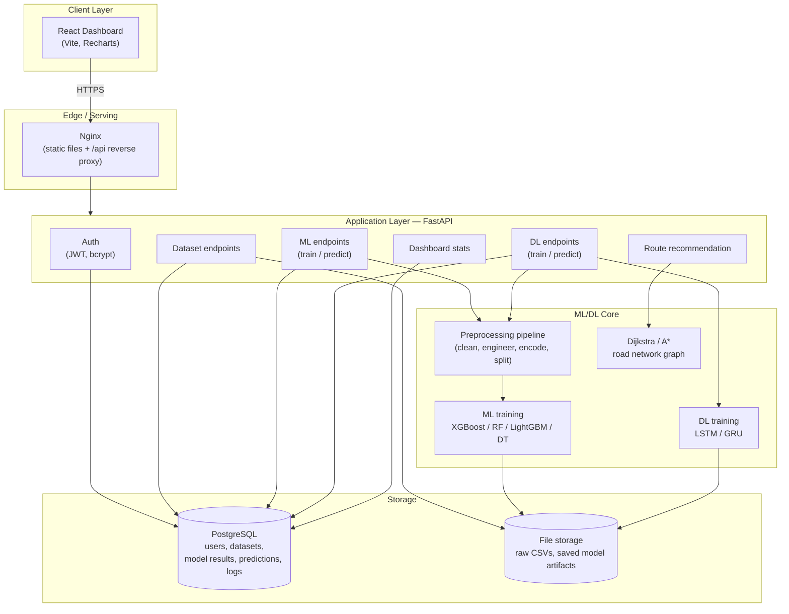

# System Architecture

**Notes**
- All ML/DL training runs synchronously inside the FastAPI request in this reference build; for real datasets, move `MLTRAIN`/`DLTRAIN` calls to a background task queue (Celery + Redis, or FastAPI `BackgroundTasks` at minimum) so uploads/training don't block the event loop.
- `FILES` currently means local disk (`backend/data`, `backend/saved_models`), mounted as Docker volumes. Swap for S3 in production (Module 11 of the original spec) by changing `RAW_DATA_DIR`/`MODEL_DIR` handling to an S3-backed storage class.
