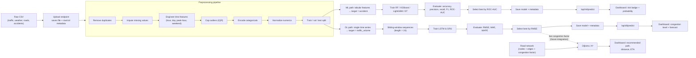

# Data Flow Diagram

```mermaid
flowchart LR
    RAW["Raw CSV\n(traffic, weather, roads, accidents)"] --> UPLOAD["Upload endpoint\nsaves file + row/col metadata"]
    UPLOAD --> PREP["Preprocessing pipeline"]

    subgraph PREP["Preprocessing pipeline"]
        direction TB
        P1["Remove duplicates"] --> P2["Impute missing values"]
        P2 --> P3["Engineer time features\n(hour, day, peak-hour, weekend)"]
        P3 --> P4["Cap outliers (IQR)"]
        P4 --> P5["Encode categoricals"]
        P5 --> P6["Normalize numerics"]
        P6 --> P7["Train / val / test split"]
    end

    P7 --> MLPATH["ML path: tabular features → target = accident"]
    P7 --> DLPATH["DL path: single time series → target = traffic_volume"]

    MLPATH --> MLTRAIN["Train RF / XGBoost / LightGBM / DT"]
    MLTRAIN --> MLEVAL["Evaluate: accuracy, precision, recall, F1, ROC-AUC"]
    MLEVAL --> MLBEST["Select best by ROC-AUC"]
    MLBEST --> MLSAVE["Save model + metadata"]

    DLPATH --> SEQ["Sliding-window sequences\n(length = 24)"]
    SEQ --> DLTRAIN["Train LSTM & GRU"]
    DLTRAIN --> DLEVAL["Evaluate: RMSE, MAE, MAPE"]
    DLEVAL --> DLBEST["Select best by RMSE"]
    DLBEST --> DLSAVE["Save model + metadata"]

    MLSAVE --> PREDICT_ML["/api/ml/predict"]
    DLSAVE --> PREDICT_DL["/api/dl/predict"]
    PREDICT_ML --> UI["Dashboard: risk badge + probability"]
    PREDICT_DL --> UI2["Dashboard: congestion level + forecast"]

    ROADS["Road network\n(nodes + edges + congestion factor)"] --> ROUTING["Dijkstra / A*"]
    DLBEST -.->|"live congestion factor\n(future integration)"| ROUTING
    ROUTING --> UI3["Dashboard: recommended path,\ndistance, ETA"]
```
