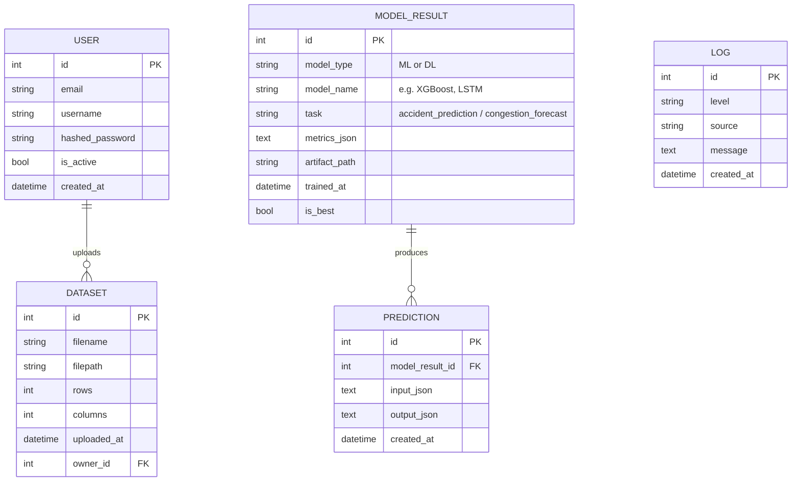

# Entity-Relationship Diagram

```mermaid
erDiagram
    USER ||--o{ DATASET : uploads
    MODEL_RESULT ||--o{ PREDICTION : produces

    USER {
        int id PK
        string email
        string username
        string hashed_password
        bool is_active
        datetime created_at
    }

    DATASET {
        int id PK
        string filename
        string filepath
        int rows
        int columns
        datetime uploaded_at
        int owner_id FK
    }

    MODEL_RESULT {
        int id PK
        string model_type "ML or DL"
        string model_name "e.g. XGBoost, LSTM"
        string task "accident_prediction / congestion_forecast"
        text metrics_json
        string artifact_path
        datetime trained_at
        bool is_best
    }

    PREDICTION {
        int id PK
        int model_result_id FK
        text input_json
        text output_json
        datetime created_at
    }

    LOG {
        int id PK
        string level
        string source
        text message
        datetime created_at
    }
```
