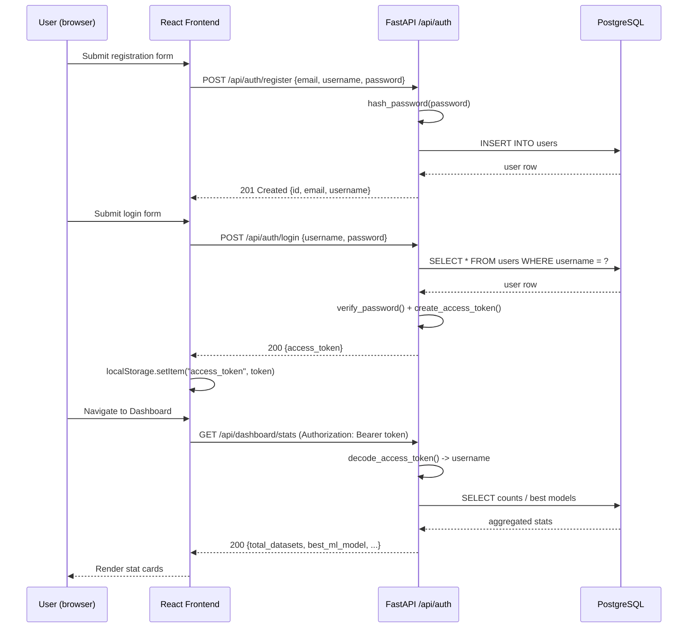
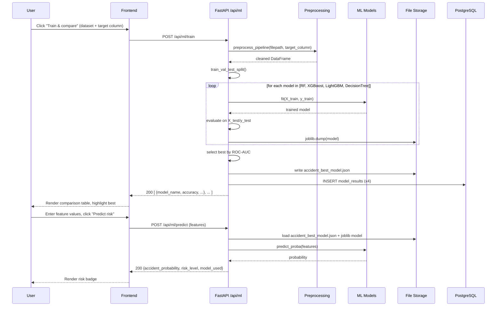

# Sequence Diagrams

## 1. Register → Login → Authenticated request

```mermaid
sequenceDiagram
    participant U as User (browser)
    participant F as React Frontend
    participant A as FastAPI /api/auth
    participant DB as PostgreSQL

    U->>F: Submit registration form
    F->>A: POST /api/auth/register {email, username, password}
    A->>A: hash_password(password)
    A->>DB: INSERT INTO users
    DB-->>A: user row
    A-->>F: 201 Created {id, email, username}

    U->>F: Submit login form
    F->>A: POST /api/auth/login {username, password}
    A->>DB: SELECT * FROM users WHERE username = ?
    DB-->>A: user row
    A->>A: verify_password() + create_access_token()
    A-->>F: 200 {access_token}
    F->>F: localStorage.setItem("access_token", token)

    U->>F: Navigate to Dashboard
    F->>A: GET /api/dashboard/stats  (Authorization: Bearer token)
    A->>A: decode_access_token() -> username
    A->>DB: SELECT counts / best models
    DB-->>A: aggregated stats
    A-->>F: 200 {total_datasets, best_ml_model, ...}
    F-->>U: Render stat cards
```

## 2. Train → Predict (ML accident risk)

```mermaid
sequenceDiagram
    participant U as User
    participant F as Frontend
    participant API as FastAPI /api/ml
    participant PIPE as Preprocessing
    participant MODELS as ML Models
    participant FS as File Storage
    participant DB as PostgreSQL

    U->>F: Click "Train & compare" (dataset + target column)
    F->>API: POST /api/ml/train
    API->>PIPE: preprocess_pipeline(filepath, target_column)
    PIPE-->>API: cleaned DataFrame
    API->>API: train_val_test_split()
    loop for each model in [RF, XGBoost, LightGBM, DecisionTree]
        API->>MODELS: fit(X_train, y_train)
        MODELS-->>API: trained model
        API->>API: evaluate on X_test/y_test
        API->>FS: joblib.dump(model)
    end
    API->>API: select best by ROC-AUC
    API->>FS: write accident_best_model.json
    API->>DB: INSERT model_results (x4)
    API-->>F: 200 [ {model_name, accuracy, ...}, ... ]
    F-->>U: Render comparison table, highlight best

    U->>F: Enter feature values, click "Predict risk"
    F->>API: POST /api/ml/predict {features}
    API->>FS: load accident_best_model.json + joblib model
    API->>MODELS: predict_proba(features)
    MODELS-->>API: probability
    API-->>F: 200 {accident_probability, risk_level, model_used}
    F-->>U: Render risk badge
```
